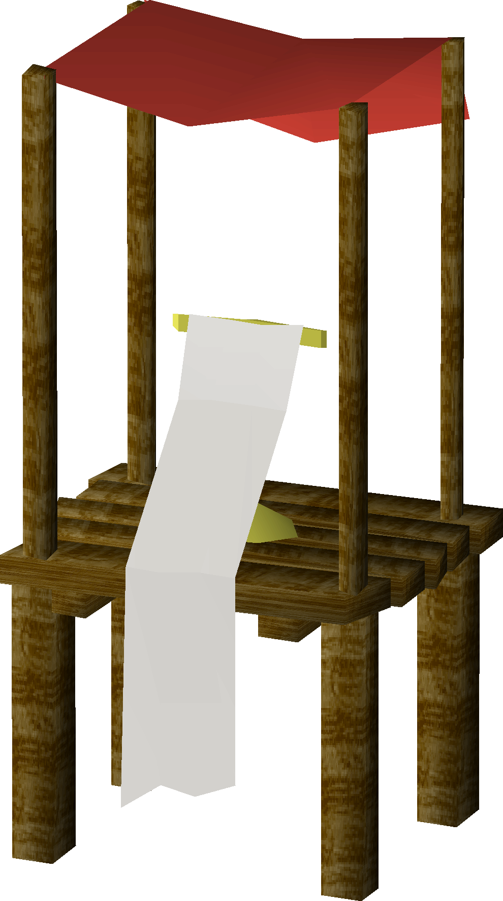

<a id="readme-top" />

<!-- PROJECT SHIELDS -->
<div align="center">

[![Issues][issues-shield]][issues-url]
[![Stargazers][stars-shield]][stars-url]
[![Forks][forks-shield]][forks-url]
[![Contributors][contributors-shield]][contributors-url]
[![License][license-shield]][license-url]

<!-- PROJECT LOGO -->

  <br />
  <a href="https://osrs.wiki/w/Pet_list">
    
  </a>
  <h3>OSRS Pet List</h3>
  <p>
    Internet Menagerie
    <br />
    <a href="">
      <strong>Explore the docs »</strong>
    </a>
    <br />
    <br />
    <a href="">
      View Demo
    </a>
    &middot;
    <a href="">
      Report Bug
    </a>
    &middot;
    <a href="">
      Request Feature
    </a>
  </p>
</div>

<!-- TABLE OF CONTENTS -->

<details>
  <summary>Table of Contents</summary>
  <ol>
    <li>
      <a href="#about-the-project">About The Project</a>
      <ul>
        <li>
          <a href="#built-with">Built With</a>
        </li>
      </ul>
    </li>
    <li>
      <a href="#getting-started">Getting Started</a>
      <ul>
        <li>
          <a href="#prerequisites">Prerequisites</a>
        </li>
        <li>
          <a href="#installation">Installation</a>
        </li>
      </ul>
    </li>
    <li>
      <a href="#usage">Usage</a>
    </li>
    <li>
      <a href="#roadmap">Roadmap</a>
    </li>
    <li>
      <a href="#contributing">Contributing</a>
    </li>
    <li>
      <a href="#license">License</a>
    </li>
    <li>
      <a href="#contact">Contact</a>
    </li>
    <li>
      <a href="#acknowledgments">Acknowledgments</a>
    </li>
  </ol>
</details>

<!-- ABOUT THE PROJECT -->

## About The Project

<p align="right">
  (<a href="#readme-top">back to top</a>)
</p>

### Built With

-   ![NodeJS][nodejs-shield]
-   ![React][react-shield]
-   ![TypeScript][ts-shield]
-   ![Vite][vite-shield]
-   ![PNPM][pnpm-shield]

<p align="right">
  (<a href="#readme-top">back to top</a>)
</p>

<!-- GETTING STARTED -->

## Getting Started

To set up your project locally follow these simple example steps.

### Prerequisites

-   Install [pnpm](https://pnpm.io/installation)

### Installation

1. Clone the repo

    ```sh
    git clone https://github.com/manc1n1/osrs-pet-list.git
    ```

2. Install NPM packages

    ```sh
    pnpm i
    ```

<p align="right">
  (<a href="#readme-top">back to top</a>)
</p>

<!-- USAGE EXAMPLES -->

## Usage

_For more examples, please refer to the [Documentation](https://example.com)_

<p align="right">
  (<a href="#readme-top">back to top</a>)
</p>

<!-- ROADMAP -->

## Roadmap

See the [open issues](https://github.com/manc1n1/osrs-pet-list/issues) for a full list of proposed features (and known issues).

<p align="right">
  (<a href="#readme-top">back to top</a>)
</p>

<!-- CONTRIBUTING -->

## Contributing

Contributions are what make the open source community such an amazing place to learn, inspire, and create. Any contributions you make are **greatly appreciated**.

If you have a suggestion that would make this better, please fork the repo and create a pull request. You can also simply open an issue with the tag "enhancement".
Don't forget to give the project a star! Thanks again!

1. Fork the Project
2. Create your Feature Branch (`git checkout -b feature/AmazingFeature`)
3. Commit your Changes (`git commit -m 'Add some AmazingFeature'`)
4. Push to the Branch (`git push origin feature/AmazingFeature`)
5. Open a Pull Request

### Top contributors:

<a href="https://github.com/manc1n1/osrs-pet-list/graphs/contributors">
  
</a>

<p align="right">
  (<a href="#readme-top">back to top</a>)
</p>

<!-- LICENSE -->

## License

Distributed under the `<license>`. See `LICENSE.md` for more information.

<p align="right">
  (<a href="#readme-top">back to top</a>)
</p>

<!-- CONTACT -->

## Contact

Joe Mancini - [@0xSuspext](https://twitter.com/0xSuspext) - mancinij1111@gmail.com

Project Link: [https://github.com/manc1n1/osrs-pet-list](https://github.com/manc1n1/osrs-pet-list)

[![LinkedIn][linkedin-shield]][linkedin-url]

<p align="right">
  (<a href="#readme-top">back to top</a>)
</p>

<!-- ACKNOWLEDGMENTS -->

## Acknowledgments

-   [Old School RuneScape](https://oldschool.runescape.com/) is a trademark of [Jagex Ltd.](https://www.jagex.com/)
-   [RuneLite](https://runelite.net/)
-   [OSRS Wiki](https://osrs.wiki/)

<p align="right">
  (<a href="#readme-top">back to top</a>)
</p>

<!-- MARKDOWN LINKS & IMAGES -->
<!-- https://www.markdownguide.org/basic-syntax/#reference-style-links -->

[contributors-shield]: https://img.shields.io/github/contributors/manc1n1/osrs-pet-list.svg?style=for-the-badge
[contributors-url]: https://github.com/manc1n1/osrs-pet-list/graphs/contributors
[forks-shield]: https://img.shields.io/github/forks/manc1n1/osrs-pet-list.svg?style=for-the-badge
[forks-url]: https://github.com/manc1n1/osrs-pet-list/network/members
[gmail-shield]: https://img.shields.io/badge/Gmail-D14836?style=for-the-badge&logo=gmail&logoColor=white
[gmail-url]: mailto:mancinij1111@gmail.com
[issues-shield]: https://img.shields.io/github/issues/manc1n1/osrs-pet-list.svg?style=for-the-badge
[issues-url]: https://github.com/manc1n1/osrs-pet-list/issues
[license-shield]: https://img.shields.io/github/license/manc1n1/osrs-pet-list.svg?style=for-the-badge
[license-url]: https://github.com/manc1n1/osrs-pet-list/blob/master/LICENSE.md
[linkedin-shield]: https://img.shields.io/badge/linkedin-%230077B5.svg?style=for-the-badge&logo=linkedin&logoColor=white
[linkedin-url]: https://linkedin.com/in/manc1n1
[mui-shield]: https://img.shields.io/badge/MUI-%230081CB.svg?style=for-the-badge&logo=mui&logoColor=white
[nodejs-shield]: https://img.shields.io/badge/node.js-6DA55F?style=for-the-badge&logo=node.js&logoColor=white
[pnpm-shield]: https://img.shields.io/badge/pnpm-%234a4a4a.svg?style=for-the-badge&logo=pnpm&logoColor=f69220
[react-shield]: https://img.shields.io/badge/react-%2320232a.svg?style=for-the-badge&logo=react&logoColor=%2361DAFB
[stars-shield]: https://img.shields.io/github/stars/manc1n1/osrs-pet-list.svg?style=for-the-badge
[stars-url]: https://github.com/manc1n1/osrs-pet-list/stargazers
[ts-shield]: https://img.shields.io/badge/typescript-%23007ACC.svg?style=for-the-badge&logo=typescript&logoColor=white
[vite-shield]: https://img.shields.io/badge/vite-%23646CFF.svg?style=for-the-badge&logo=vite&logoColor=white
[x-shield]: https://img.shields.io/badge/X-%23000000.svg?style=for-the-badge&logo=X&logoColor=white
[x-url]: https://twitter.com/0xSuspext
